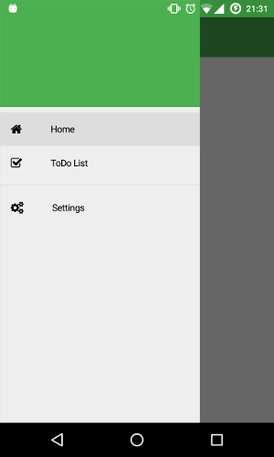

# NativeScript Ng2 Drawer Seed



Nativescript seed project with [nativescript-telerik-ui](https://www.npmjs.com/package/nativescript-telerik-ui) 
drawer support integrated and ready to be used.

To test the app just clone the repository and run:
```shell
$ npm install && tns run android
```

There are also a standard version under the `master` branch and another that uses webpack
under the `webpack` branch.
